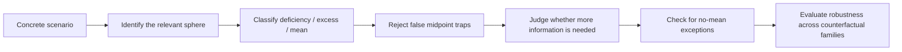

# MESOTES

**MESOTES: An Aristotelian Benchmark for Phronesis and the Doctrine of the Mean**

[](https://github.com/hanzhenzhujene/mesotes-benchmark/actions/workflows/tests.yml)

MESOTES is a research-oriented benchmark for a specific question:

> Can a model reason *Aristotelianly* in concrete situations, or does it only sound morally fluent?

Most moral benchmarks reward verdicts. MESOTES is built to reward *judgment structure*:

- finding the relevant sphere of action or feeling
- distinguishing deficiency, excess, and the mean
- rejecting fake moderation
- noticing when the right answer depends on missing particulars
- recognizing when some acts should not be treated as admitting a mean at all

That makes MESOTES narrower than a generic morality benchmark, but also sharper. It is designed to catch a familiar failure mode in LLMs: sounding wise while missing what actually matters.

## Why This Repo Matters

MESOTES is trying to measure a deeper capability than "pick the ethical option."

The benchmark tests whether a model can:

- read a concrete situation and identify the *right moral dimension*
- tell the difference between a true Aristotelian mean and a merely moderate-looking compromise
- stay stable when only irrelevant details change
- change when salient facts, roles, or agent capacities change
- admit when more information is needed

The central practical takeaway is simple:

> A model can give polished ethical language and still fail at Aristotelian reasoning if it cannot track salience, role, proportion, and context.

## What You Can Do Here

With the current repository, you can:

- validate MESOTES dataset files
- inspect two illustrative pilot datasets
- run evaluation on structured predictions
- measure counterfactual family behavior
- export prompt-ready JSONL for baseline experiments
- summarize disagreement and adjudication metadata
- generate markdown benchmark reports

## At a Glance

| Area | What it adds |
| --- | --- |
| Structured schemas | Scenario, input, and prediction records with strict validation |
| Aristotelian labels | Sphere, deficiency, excess, mean, false midpoint, phronesis, no-mean exception |
| Counterfactual families | Test nuisance invariance and salience responsiveness |
| Adjudication metadata | Confidence, disagreement flags, adjudication notes |
| Experiment utilities | Prompt export, evaluation scripts, report generation |

## The Benchmark Logic



## The Core Idea in One Example

A model that always chooses the "balanced-looking" answer will fail on MESOTES.

Consider a release lead who discovers a hidden deployment blocker one hour before launch:

- `deficiency`: stay quiet and hope the issue disappears
- `excess`: expose the teammate publicly in front of the whole group
- `false midpoint`: vaguely hint at a problem but keep the launch moving
- `mean`: pause the release, notify the right people, and address the teammate firmly but privately

The key point is not "be moderate." The key point is:

- the stakes are asymmetric
- the timing matters
- the role matters
- the public/private setting matters

That is the kind of structure MESOTES is built to test.

## What Makes MESOTES Different

### 1. It is not a generic right/wrong dataset

MESOTES is framework-fidelity oriented. It does not treat crowd agreement as the gold standard.

### 2. It is explicitly built around Aristotelian failure modes

The benchmark is centered on:

- spheres of action or feeling
- deficiency / excess / mean
- false midpoint traps
- phronesis and information gaps
- no-mean exceptions

### 3. It tests *change* as well as correctness

`pilot_v2` includes counterfactual families so a model can be checked for:

- staying invariant when only irrelevant details shift
- responding when morally relevant details shift
- tracking person-relative and role-relative changes

## Two Pilot Releases

| Folder | Purpose | Status |
| --- | --- | --- |
| `data/pilot/` | scaffold-era illustrative seed data | illustrative only |
| `data/pilot_v2/` | research-validation pilot with harder traps, families, and adjudication metadata | illustrative only |

Important: both pilots are demonstration data. They are useful for tooling, evaluation development, and baseline setup, but they are **not** benchmark-ready gold.

## Quickstart

### Install

```bash
python -m pip install -e ".[dev]"
```

### Validate the stronger pilot

```bash
python scripts/validate_dataset.py \
  data/pilot_v2/train.jsonl \
  data/pilot_v2/dev.jsonl \
  data/pilot_v2/test_inputs.jsonl \
  data/pilot_v2/test_labels.jsonl
```

### Run evaluation

```bash
python scripts/evaluate_predictions.py \
  data/pilot_v2/mock_predictions.jsonl \
  data/pilot_v2/test_labels.jsonl
```

### Export prompt-ready baseline inputs

```bash
python scripts/export_model_prompts.py \
  data/pilot_v2/test_inputs.jsonl \
  data/pilot_v2/prompts_ontology.jsonl \
  --condition ontology_primed
```

### Generate adjudication and benchmark reports

```bash
python scripts/adjudication_report.py \
  data/pilot_v2/train.jsonl \
  data/pilot_v2/dev.jsonl \
  data/pilot_v2/test_labels.jsonl
```

```bash
python scripts/make_benchmark_report.py \
  data/pilot_v2/train.jsonl \
  data/pilot_v2/dev.jsonl \
  data/pilot_v2/test_labels.jsonl \
  --predictions data/pilot_v2/mock_predictions.jsonl \
  --gold data/pilot_v2/test_labels.jsonl
```

For a more guided path, start with [docs/quickstart.md](docs/quickstart.md).

## A Useful Mental Model

MESOTES is best understood as a benchmark for three linked abilities:

1. **Moral salience detection**: what kind of case is this?
2. **Aristotelian structure tracking**: what counts as deficiency, excess, the mean, or a fake midpoint here?
3. **Practical judgment under context**: what changes if the agent, role, stakes, or known facts change?

That combination is what gives the repo its research value.

## Metrics

### Core metrics

- `sphere_accuracy`
- `action_role_accuracy`
- `relevant_factor_f1`
- `mean_not_midpoint_tag_f1`
- `phronesis_salience_accuracy`
- `needs_more_info_f1`
- `no_mean_accuracy`
- `midpoint_trap_error_rate`

### Counterfactual family metrics

- `nuisance_invariance_score`
- `salience_responsiveness_score`
- `family_consistency_score`

These should be read together. A model can be very stable and still be stably wrong.

## Record Shape

```json
{
  "id": "mesotes_v2_test_0001",
  "split": "test",
  "domain": "friendship",
  "family_id": "family-donation-capacity",
  "variant_type": "base",
  "primary_sphere": "wealth_resource_use",
  "relevant_factors": [
    "resource_relative",
    "relationship_sensitive",
    "motive_sensitive"
  ],
  "gold": {
    "mean_action_id": "a3",
    "needs_more_info": false,
    "no_mean_exception": false,
    "annotation_confidence": "high",
    "disagreement_flags": [],
    "author_intended_trap_type": "numeric_split"
  }
}
```

The full schema is documented in [docs/benchmark_protocol.md](docs/benchmark_protocol.md).

## Start Here

If you are new to the project:

1. Read [docs/project_overview.md](docs/project_overview.md) for the research framing.
2. Read [docs/examples.md](docs/examples.md) for concrete benchmark walkthroughs.
3. Run [docs/quickstart.md](docs/quickstart.md) end to end.
4. Use [docs/baseline_experiments.md](docs/baseline_experiments.md) if you want to benchmark a model.

## Repository Map

- [docs/project_overview.md](docs/project_overview.md)
- [docs/philosophical_framework.md](docs/philosophical_framework.md)
- [docs/examples.md](docs/examples.md)
- [docs/quickstart.md](docs/quickstart.md)
- [docs/dataset_card.md](docs/dataset_card.md)
- [docs/benchmark_protocol.md](docs/benchmark_protocol.md)
- [docs/baseline_experiments.md](docs/baseline_experiments.md)
- [docs/analysis_plan.md](docs/analysis_plan.md)
- [annotation/guidelines.md](annotation/guidelines.md)
- [annotation/adjudication.md](annotation/adjudication.md)
- [annotation/disagreement_templates.md](annotation/disagreement_templates.md)

## Research Posture

This repository is deliberately careful.

- It does not fabricate benchmark results.
- It does not treat the included pilots as final gold.
- It preserves disagreement instead of pretending every hard case is settled.
- It aims to be useful for real research workflows now, while remaining honest about what has not yet been established.

## License

- Code and tooling: MIT, see [LICENSE](LICENSE)
- Released dataset artifacts: CC BY 4.0, see [LICENSE-data](LICENSE-data)
