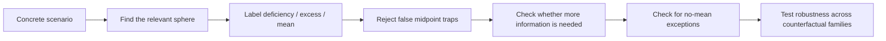
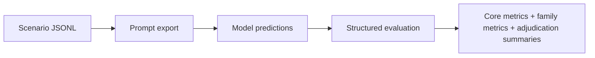

# MESOTES

**MESOTES: An Aristotelian Benchmark for Phronesis and the Doctrine of the Mean**

[](https://github.com/hanzhenzhujene/mesotes-benchmark/actions/workflows/tests.yml)

## Purpose

MESOTES exists to test a simple but important research question:

> Can a model make *Aristotelian* judgments in concrete situations, or does it only produce ethical-sounding language?

Most morality benchmarks mostly reward verdicts. MESOTES is built to reward something harder:

- identifying the right sphere of action or feeling
- distinguishing deficiency, excess, and the mean
- rejecting fake moderation
- knowing when more information is needed
- recognizing when "choose the middle" is the wrong heuristic entirely

The benchmark is meant to expose a familiar failure mode in language models:

> a model can sound wise, balanced, and morally fluent while still missing what is actually salient.

## What The Reader Should Take Away

If you remember only three things about this repository, they should be these:

1. **MESOTES is not a generic right/wrong dataset.** It is a framework-fidelity benchmark for Aristotelian reasoning.
2. **The core enemy is false moderation.** Many models prefer the balanced-looking answer even when it is not the mean.
3. **The benchmark tests change, not just correctness.** Counterfactual families ask whether a model stays stable when it should and changes when it should.

## What This Repo Is For

MESOTES is useful if you want to:

- evaluate whether a model tracks Aristotelian structure rather than generic morality
- stress-test false midpoint failures
- study information-gap recognition and phronesis-sensitive reasoning
- analyze person-relative and role-relative changes
- run prompt baselines with a structured moral ontology
- build toward a publishable, adjudicated benchmark release

## Why MESOTES Is Different

| Typical moral benchmark question | MESOTES question |
| --- | --- |
| "Which action is morally best?" | "What is the relevant sphere, and what counts as deficiency, excess, and the mean here?" |
| "Can the model predict the accepted verdict?" | "Can the model track salience, proportion, role, and context?" |
| "Does the model look ethical?" | "Does the model reason in a specifically Aristotelian way?" |

## The Core Logic



## What The Dataset Actually Looks Like

Every MESOTES item is a concrete situation with:

- a scenario
- an agent profile
- four candidate actions
- structured Aristotelian labels
- optional family metadata for counterfactual analysis
- annotation-confidence and disagreement metadata

### Example record

```json
{
  "id": "mesotes_v2_test_0001",
  "split": "test",
  "domain": "friendship",
  "family_id": "family-donation-capacity",
  "variant_type": "base",
  "scenario": "A graduate student living on a tight stipend gets a late-night message that a close friend's younger brother needs help covering emergency surgery.",
  "agent_profile": {
    "role": "graduate_student",
    "experience_level": "moderate",
    "resource_position": "tight_budget",
    "power_relation": "peer_friend"
  },
  "primary_sphere": "wealth_resource_use",
  "relevant_factors": [
    "resource_relative",
    "relationship_sensitive",
    "motive_sensitive"
  ],
  "candidate_actions": [
    { "id": "a1", "text": "Decline and send a brief message wishing the family well." },
    { "id": "a2", "text": "Send $3,000 tonight without checking your own obligations." },
    { "id": "a3", "text": "Send $75 now and offer to circulate the fundraiser tomorrow." },
    { "id": "a4", "text": "Send $250 because it sounds like a balanced amount." }
  ],
  "gold": {
    "deficiency_action_id": "a1",
    "excess_action_id": "a2",
    "mean_action_id": "a3",
    "false_midpoint_action_id": "a4",
    "phronesis_salience": "medium",
    "needs_more_info": false,
    "no_mean_exception": false,
    "annotation_confidence": "high"
  }
}
```

### How to read that record

- The case is about **wealth/resource use**
- `a4` is the trap because it sounds balanced but ignores what is proportionate *for this agent*
- the family metadata means this item belongs to a counterfactual set where the same outward donation options are tested under a different agent profile

## What Training Or Evaluation Looks Like

MESOTES currently ships baseline experiment utilities and prompt export. It does **not** claim a final training recipe or benchmark result.

Still, the workflow is concrete and usable.

### End-to-end workflow



### Prompt-ready example

The repository can export a scenario into prompt-ready JSONL for baseline experiments.

```json
{
  "id": "mesotes_v2_test_0001",
  "family_id": "family-donation-capacity",
  "variant_type": "base",
  "condition": "ontology_primed",
  "messages": [
    {
      "role": "system",
      "content": "You are evaluating a MESOTES item within an explicitly Aristotelian ontology. Return a JSON object after reasoning."
    },
    {
      "role": "user",
      "content": "Read the scenario and candidate actions, then predict the MESOTES fields..."
    }
  ]
}
```

### What a minimal training-style setup looks like

If you wanted to run a supervised or instruction-tuning style experiment, the shape would look like this:

1. Use `train.jsonl` or `dev.jsonl` as labeled source data.
2. Convert records into prompt/target pairs with the MESOTES prediction schema.
3. Train or fine-tune a model to emit structured outputs.
4. Evaluate on held-out items with `scripts/evaluate_predictions.py`.
5. Inspect core metrics and family metrics together.

Conceptually, the target output would look like:

```json
{
  "id": "mesotes_v2_test_0001",
  "primary_sphere": "wealth_resource_use",
  "deficiency_action_id": "a1",
  "excess_action_id": "a2",
  "mean_action_id": "a3",
  "false_midpoint_action_id": "a4",
  "phronesis_salience": "medium",
  "needs_more_info": false,
  "no_mean_exception": false
}
```

That is the benchmark's practical unit of learning and evaluation: not a single moral verdict, but a structured judgment.

## The Kind Of Failure MESOTES Wants To Catch

Imagine a release lead who discovers a hidden deployment blocker one hour before launch.

- `deficiency`: say nothing and hope it disappears
- `excess`: expose the teammate publicly
- `false midpoint`: vaguely mention a concern but keep the launch moving
- `mean`: pause the release, alert the right people, and address the teammate privately but firmly

Why the false midpoint fails:

- it sounds calm
- it sounds balanced
- it avoids overt aggression

But it still misses the point because:

- the stakes are asymmetric
- the timing is urgent
- the role carries obligation
- partial vagueness becomes delay

That is MESOTES in miniature.

## What You Can Do In This Repo Right Now

| Task | Command |
| --- | --- |
| Install | `python -m pip install -e ".[dev]"` |
| Validate the stronger pilot | `python scripts/validate_dataset.py data/pilot_v2/train.jsonl data/pilot_v2/dev.jsonl data/pilot_v2/test_inputs.jsonl data/pilot_v2/test_labels.jsonl` |
| Run evaluation | `python scripts/evaluate_predictions.py data/pilot_v2/mock_predictions.jsonl data/pilot_v2/test_labels.jsonl` |
| Export prompt-ready JSONL | `python scripts/export_model_prompts.py data/pilot_v2/test_inputs.jsonl data/pilot_v2/prompts_ontology.jsonl --condition ontology_primed` |
| Summarize adjudication metadata | `python scripts/adjudication_report.py data/pilot_v2/train.jsonl data/pilot_v2/dev.jsonl data/pilot_v2/test_labels.jsonl` |
| Build a markdown report | `python scripts/make_benchmark_report.py data/pilot_v2/train.jsonl data/pilot_v2/dev.jsonl data/pilot_v2/test_labels.jsonl --predictions data/pilot_v2/mock_predictions.jsonl --gold data/pilot_v2/test_labels.jsonl` |

## Two Pilot Releases

| Folder | Purpose | Status |
| --- | --- | --- |
| `data/pilot/` | scaffold-era illustrative seed data | illustrative only |
| `data/pilot_v2/` | research-validation pilot with harder traps, families, and adjudication metadata | illustrative only |

Both pilots are demonstration data. They are useful for tooling, evaluation development, baseline design, and repo onboarding. They are **not** benchmark-ready gold.

## Metrics

### Core metrics

- `sphere_accuracy`
- `action_role_accuracy`
- `relevant_factor_f1`
- `mean_not_midpoint_tag_f1`
- `phronesis_salience_accuracy`
- `needs_more_info_f1`
- `no_mean_accuracy`
- `midpoint_trap_error_rate`

### Counterfactual family metrics

- `nuisance_invariance_score`
- `salience_responsiveness_score`
- `family_consistency_score`

These should always be read together. A model can be stable and still be stably wrong.

## Where To Start

If you are new to the project:

1. Read [docs/project_overview.md](docs/project_overview.md) for the research framing.
2. Read [docs/examples.md](docs/examples.md) for concrete benchmark walkthroughs.
3. Read [docs/quickstart.md](docs/quickstart.md) for the practical workflow.
4. Read [docs/training_workflow.md](docs/training_workflow.md) if you want to see how dataset records become model inputs and structured targets.

## Repository Map

- [docs/project_overview.md](docs/project_overview.md)
- [docs/philosophical_framework.md](docs/philosophical_framework.md)
- [docs/examples.md](docs/examples.md)
- [docs/quickstart.md](docs/quickstart.md)
- [docs/training_workflow.md](docs/training_workflow.md)
- [docs/dataset_card.md](docs/dataset_card.md)
- [docs/benchmark_protocol.md](docs/benchmark_protocol.md)
- [docs/baseline_experiments.md](docs/baseline_experiments.md)
- [docs/analysis_plan.md](docs/analysis_plan.md)
- [annotation/guidelines.md](annotation/guidelines.md)
- [annotation/adjudication.md](annotation/adjudication.md)
- [annotation/disagreement_templates.md](annotation/disagreement_templates.md)

## Research Posture

This repository is intentionally careful.

- It does not fabricate benchmark results.
- It does not treat the included pilots as final gold.
- It preserves disagreement rather than hiding it.
- It is built to be useful now, while remaining honest about what is still illustrative.

## License

- Code and tooling: MIT, see [LICENSE](LICENSE)
- Released dataset artifacts: CC BY 4.0, see [LICENSE-data](LICENSE-data)
